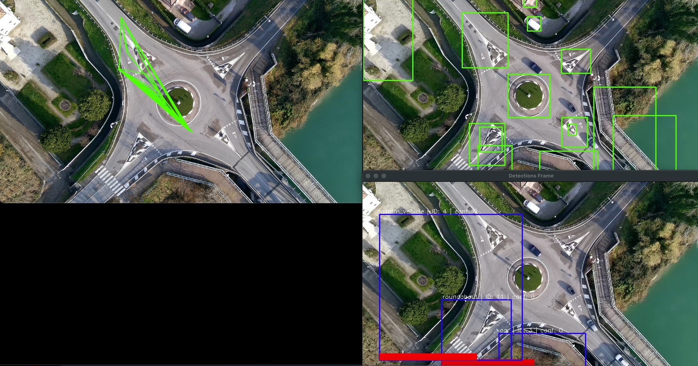
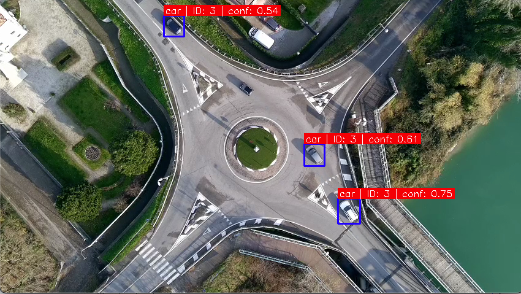

# Welcome to the Mecatron Interview Task!
# TASK DOCUMENT IS UPDATED, CHANGED FROM NEW BRANCH TO FORK
## Link to UPDATED Task Document: https://drive.google.com/file/d/1bnukmJjzGpEtv415BS-KYW17t_oSF8-J/view?usp=sharing
## Link to Video: https://drive.google.com/file/d/1zWU8Qxa7ST2_K4K0V5vtbojp50ONZSwX/view?usp=sharing
## Link to Form: https://docs.google.com/forms/d/e/1FAIpQLScrNDGAydfajFhp-OjQosYaQHAtSXcYwnZmGGVCp3NnsR8aXA/viewform?usp=header

> [!WARNING]
> ### ENSURE YOUR CODE CAN BE RUN BEFORE SUBMISSION. RUNTIME ERRORS ARE AN AUTOMATIC FAIL IF NOT EASILY FIXED. WE WILL ONLY RUN `python main.py` WHEN TESTING YOUR CODE!

> [!NOTE]
> - The task is designed to be slightly difficult but doable. Try your best and don't worry if you are unable to fully complete all the tasks
> - If you are unable to complete a task, write in pseudocode (commented of course) what you may have done or are trying to achieve
> - You can freely edit any part of the code, you are only **disallowed** from:
>   - Changing the AI model
>   - Text information in our detection annotations
>   - Importing other libraries not already included in the scripts or in the Python standard libraries
> - Steps are written without detail on purpose, try your best to google and find information yourself
> - Read the document carefully! The ability to read and follow steps is a sign of a good programmer
> - The use of AI tools is allowed, but do not blindly copy
> - Pro tip: Don’t just perform trial and error, look through every function and follow the logic and outputs

> [!TIP]
> - **If you messed up and accidentally Git pushed, simply drop the commit and force push to your fork, you have full control over it!**
> - **Those underscores in tracers.py are hiding something useful...**

### What you should be seeing when you run `python main.py` (windows are resized)

### Example solution for proper detections:

### Example solution for tracing the white car:

### Live example of tracing solution:

